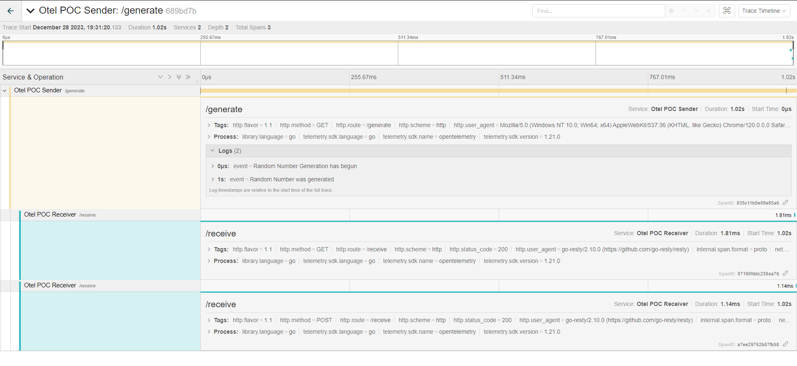

# Otel POC

OpenTelemetry (Otel) is an observability framework that helps to capture distributed traces and metrics from applications. It helps in monitoring and diagnosing performance issues in microservices architectures.

This application generates ```Traces```, ```Spans``` and ```Logs```. The purpose of the application is to understand how OpenTelemetry traces and spans flow across a simple application. The application generates a random number upon every refresh of the webpage and corresponding traces and spans are generated upon every stage of code flow. 

## Features/Accomplishments of the application
1. Developed a golang application that that has two endpoints/services and generates OpenTelemetry traces and spans along with logs (using logrus). All the spans and logs generated by different endpoints are tracked under the same trace in their order of occurence.
2. Setup OpenTelemetry Collector, Jaeger and Grafana in chaos-unica1 GCP cluster, and connected the architecture together for them to communicate.
3. Ran the application and verifed the telemetry signals are collected in OpenTelemetry Collector and are exported to Jaeger and Grafana.
4. Engineered a failure scenario to understand how the traces/spans are generated during a failure, and to see if appropriate logs are generated.
5. Created a Dockerfile and application.yaml to deploy the application in Kubernetes.

## Setup
Technologies used: ```Golang v1.20```, ```OpenTelemetry```, ```Jaeger```, ```Grafana```

### Installation Setup

#### OpenTelemetry 

1. Get the Certificate Manager (This is required for Jaeger Installation as well) - 

    ```kubectl apply -f https://github.com/cert-manager/cert-manager/releases/download/v1.8.2/cert-manager.yaml```

2. Create Namespace for Otel -

    ```kubectl create namespace opentelemetry-operator-system```

3. Install the Opentelemetry-Operator -

    ```helm repo add open-telemetry https://open-telemetry.github.io/opentelemetry-helm-charts```

    ```helm  repo update```

    ```helm install --namespace opentelemetry-operator-system my-opentelemetry-operator open-telemetry/opentelemetry-operator```

4. Create a namespace for Otel Collector -

    ```kubectl create ns otel-collector```

5. Create the manifest for OpenTelemetry Collector (otelCollector/otel-collector-daemonset.yaml)

6. Create and apply the manifest -

    ```kubectl apply -f otel-collector-demonset.yaml```

7. The OpenTelemetry Collector resources should have been created and running. Please verify it using: 
    
    ```kubectl get pods -n otel-collector```
    
    ```kubectl get svc -n otel-collector```

#### Jaeger

1. Install the Certificate Manager (Already mentioned in OpenTelemetry Collector Installation).

2. Create namespace for observability -

    ```kubectl create ns observability```

3. Get the CRDs for Jaeger Operator -

    ```kubectl create -f https://github.com/jaegertracing/jaeger-operator/releases/download/v1.36.0/jaeger-operator.yaml -n observability ```

4. You can check the installation using -

    ```kubectl get deployment jaeger-operator -n observability```

5. The Jaeger Operator was installed. Now we can create a Jaeger resource for tracing the traces and spans. The yaml file to create the resource is present in jaeger/Jaeger.yaml. To create this -

    ```kubectl apply -f jaeger/Jaeger.yaml```

8. Jaeger should now be available for you to use. It can be verified using -
    
    ```kubectl get pods```

    ```kubectl get services```

#### Grafana

1. Add the helm repo -

    ```helm repo add grafana https://grafana.github.io/helm-charts```

2. Install Grafana and set password (if needed) -

    ```helm install grafana grafana/grafana --set adminPassword=<your_password>```

## Architecture Details
There are four components to the application which are:
1.  ```Golang application``` - The application has Otel SDKs generating Telemetry signals. There are three files for this application - main.go (Driver code), server.go (which generates random number and acts as a sender), receiver.go (which receives the genereated random number from the server). In a nutshell, the application creates and receives random numbers and generates Telemetry signals. The working of the golang application is as follows:
    * ```main.go``` is where the web application runs. It also initializes the Telemetry information. It forwards the http requests to appropriate places.
    * ```otelfunctions.go``` contains all the functions required for generating and modifying Telemetry signals. 
    * ```server.go``` (technically sender.go will be more apt) generates the random number and sends a POST request of the trace/span information along with the generated number to the receiver endpoint (```http://localhost:8080/receive```). Requests to ```http://localhost:8080/generate``` reaches server.go
    * ```receiver.go``` receives the data from the sender, processes it and displays it on the terminal.  

    The important SDKs and frameworks used in the application:
    * ```OpenTelemetry SDKs``` to generate traces and spans.
    * ```logrus``` to generate logs. OpenTelemetry does not provide logging support for Golang yet as it does for traces and spans. 
    * ```Gin``` web framework used for routing purposes. Gin provides the ```otelgin``` middleware which facilitates automatic tracing of incoming HTTP requests and responses of the application.

2. ```OpenTelemetry Collector``` - Collects the Telemetry signals generated by the application, proccesses it and exports to other applications (like Jaeger, Prometheus, Loki etc.).
3. ```Jaeger``` - Displays the traces generated by the application that are exported by the OpenTelemetry Collector.
4. ```Grafana``` - Creates dashboards of the traces/spans from Jaeger.
<br>

The flow of the application in the sequential order is a follows: 
1. The Golang application generates traces, spans and logs.
2. They are then sent to the ```localhost:4318``` endpoint which is where the OpenTelemetry Collector runs.
3. The OpenTelemetry Collector collects all the data (traces, spans and logs) generated by the application and it then exports them to the Jaeger Collector (running at port ```4317```).
4. The Jaeger Collector then collects the data sent by the Otel Collector, and the collected data can be viewed using Jaeger Query (running at port ```16686```).
5. The Jaeger Query acts as a datasource for Grafana (running at port ```3000```), and the traces/spans can be viewed from Grafana as well.  

## How to run the code
1. Connect to the GCP cluster (the architecture is set up in chaos-unica1 cluster)

    ```gcloud container clusters get-credentials chaos-unica1 --zone us-central1-c --project blackjack-209019```

2.  Run the main application 
    
    ```cd src```

    ```go run main/main.go```

3. Port-forward the applications

    * Otel Collector -

        ```kubectl port-forward svc/otel-collector-daemonset-collector -n otel-collector 4318:4318```

    * Jaeger (Query and Collector) - 

        ```kubectl port-forward svc/jaeger-query 16686:16686```

      ```kubectl port-forward svc/jaeger-collector 4317:4317```

    * Grafana -

        ```kubectl port-forward svc/grafana 3000:80 -n monitoring```

4. Visit ```http://localhost:8080/generate```. It will generate a new random number upon each refresh. New corresponding traces, spans and logs will be created upon each refresh

## What to see after running the code
1. Visit ```http://localhost:8080/generate```. You should get the output webpage something like this -

    

The terminal output should look something like this - 


2. Visit the Jaeger Query page ```http://localhost:16686/search```. You should be able to view the generated traces and span here.

    

    

    

    

    

    PS: Kindly ignore the warning in the above image - I am not sure why that occured, but it doesn't seem to occur again.

    

    

3. You can also view the traces and spans being colleced by the Otel Collector using - 

    ```kubectl get pods -n otel-collector```
    
    ```kubectl logs <pod name> -n otel-collector```

    The logs shows the telemetry signals collected by the OpenTelemetry Collector. The logs should look something like this - 

    

4. Visit Grafana at ```http://localhost:3000/```, and you can create dashboards based on the collected traces and spans.

     If asked for login use username: ```admin``` and password: ```abcd1234```. 
     
     If the the Jaeger datasource is missing use -
     
     ```jaeger-query.default.svc.cluster.local:16686``` 
     
    to connect to the Jaeger datasource.  

    

### Handling Failure Case

To see how the system reacts with failures, a simple failure scencario was created - the receiver endpoint was left empty (commenting line 59 in src/main/main.go i.e. r.POST("/receive", receiver.ReceiveTrace)). Now that we do not have an endpoint to receive the traces let us see how the traces/logs are generated in such a scenario - 


As you see from the above terminal output /receive endpoint is not available and the application gives 404 status code while trying to reach the endpoint.


The error was captured in the logs of the Jaeger trace and we are able to identify the point of failure. Notice there was no Receiver Span that was created as the Receiver endpoint does not exist.  

## Ongoing work 

The golang application present in the ```src``` folder of the repository is a single application having multiple endpoints. The traces are sent and received within the single application. The Ongoing work present in ```src2``` involves transferring telemetry signals between two independent applications (think two microservices) running concurrently. The microservice1 (sender) generates the random number and sends it to microservice2 (receiver). The goal is to send the telemetry signals between applications so that the spans are created under a single trace.

To run this:

```cd src2```

```go run microservice1/ms1.go```

```go run microservice2/ms2.go```

Vist ```http://localhost:8080/generate```

The rest of the methods (Jaeger, OpenTelemetry Collector and Grafana) are same as before.




Please be aware that this application is currently a work in progress, and there are tasks and code improvements to be made. For instance, presently, the OpenTelemetry Collector successfully collects span events and logs generated by the microservice1 (sender). However, the Otel Collector does not capture the span events and logs from microservice2 (receiver). 

If you have specific questions or need clarification on any aspect of this section or even the project, please feel free to reach out to any of us via our school email at arames25@ncsu.edu and aperuri@ncsu.edu. I will do my best to assist you and provide additional information. Thank you for reading. 

## Future Work
1. Deploy src/application.yaml with the application image (can be built using the src/Dockerfile). This will expose the application outside from the localhost. Currently, the Collector endpoint to receive traces from the k8 service is not working for a K8 application (although it works when the application is run locally). 
2. Add Otel Metrics to the application and export them to Prometheus. Similarly, export the logs to Loki. The traces from Jaeger, Metrics from Prometheus and Logs from Loki can be exported to Grafana to build dashboards. According to our understanding, Otel Collector cannot be connected directly to Grafana - you need other services (like Jaeger, Grafana and Loki) to collect the traces from the Otel Collector and export it to Grafana.  
3. Add more information to otelgin middleware.
